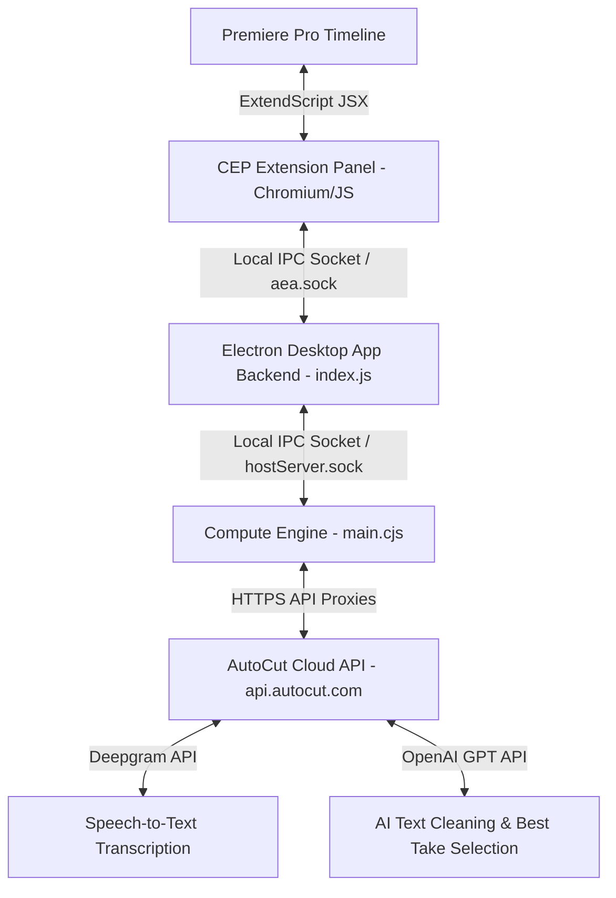

# AutoCut Mimari ve AI Kesim Motoru Analiz Raporu

Bu rapor, AutoCut (v1.36.0) uygulamasının sistem mimarisini, transkript işleme algoritmalarını ve yapay zeka tabanlı anlamlı video kesme/temizleme süreçlerini kapsayan detaylı bir teknik analizdir.

---

## 1. 🏗️ AutoCut Mimari Genel Bakış

AutoCut, Premiere Pro veya DaVinci Resolve ile doğrudan etkileşime giren, ağır hesaplama işlerini ise lokal veya bulut sunucularına devreden **hibrit** bir yapıya sahiptir.



### Deşifre Edilen Bileşenler:
1. **CEP Panel (HTML/CSS/JS)**: Kullanıcı arayüzünü barındırır. Adobe Premiere Pro'nun ExtendScript motoruyla (`evalScript`) iletişim kurarak timeline bilgilerini alır ve kesim komutlarını iletir.
2. **Electron App (Lokal/Desktop)**: Arka planda bir servis olarak çalışır. Panel ile Compute Engine arasında bir köprü oluşturur (`com.autocut.ppro` soketi üzerinden).
3. **Compute Engine (`main.cjs`)**: Ağır işlemlerin ve iş kurallarının (tasks) koordine edildiği ana Javascript motorudur.
4. **AutoCut Cloud API (`https://api.autocut.com`)**: Güvenlik ve API anahtarı yönetimi amacıyla, tüm OpenAI, Deepgram ve diğer servis isteklerini kendi sunucuları üzerinden proxy'leyerek çalıştırır.

---

## 2. 🎙️ AI Transkripsiyon ve İşleme Akışı

Çıkarılan log dosyaları (`autocut.compute.tsk_*.log`), AutoCut'ın transkripsiyon ve ses işleme için şu servisleri kullandığını doğrulamaktadır:

* **Deşifre Servisi (Deepgram)**:
  - Görev: `common-getTranscript`
  - İstekler: `https://api.autocut.com/deepgram/token` adresinden geçici token alınır ve ses dosyası `https://api.autocut.com/transcription/utterances` adresine gönderilerek kelime bazlı zaman damgalı (Word-Level Timestamps) transkript üretilir.
* **Ses Analizi (Lokal FFmpeg)**:
  - Görev: Ses dalgaları üzerinde dB tabanlı sessizlik tespiti yapılır.

---

## 3. 🧠 GPT Tabanlı "Anlamlı Kesim" ve Tekrar Analiz Motoru

Kullanıcının talep ettiği **"tüm transkripti anlamlı olacak şekilde kesip temizleme"** özelliği, AutoCut tarafında tamamen **OpenAI GPT modelleri** tarafından yönetilmektedir. Algoritma şu 4 aşamalı ardışık süreçten oluşur:

### Aşamalar ve Çalışma Mantığı:

```
[Ham Transkript] 
       │
       ▼ (Bölümleme)
1. repeat_getChapters (Transkripti anlamsal bölümlere ayırır)
       │
       ▼ (Draft Hazırlama)
2. repeat_processChunks (Kekelemeleri ve stutters temizler)
       │
       ▼ (Tekrarların Gruplanması)
3. repeat_groupTakes (Aynı ifadenin farklı denemelerini gruplar)
       │
       ▼ (En İyi Çekimin Seçimi)
4. repeat_selectTakes (En akıcı "take"i seçer, diğerlerini siler)
       │
       ▼
[Temizlenmiş Kesim Planı]
```

#### 1️⃣ `repeat_getChapters` (Bölümleme)
* **İşlem**: Uzun transkript tek seferde GPT'ye gönderilemeyeceği ve anlamsal bağın kopmaması gerektiği için, metin konu bütünlüklerine göre "bölümlere" (chapters) ayrılır.
* **İstek**: `POST https://api.autocut.com/openAI/repeat-chapters`

#### 2️⃣ `repeat_processChunks` (Temiz Taslak / Kekeleme Temizliği)
* **İşlem**: Bölümlenen kelime grupları GPT'ye gönderilerek kekelemeler, gereksiz "ııı", "şey" gibi filler kelimeler ve anlamsız takılmalar temizlenir. GPT arka planda temizlenmiş akıcı bir metin taslağı (clean script) yazar.
* **İstek**: `POST https://api.autocut.com/openAi/repeat-get-script`

#### 3️⃣ `repeat_groupTakes` (Çekim Gruplama)
* **İşlem**: Kurguda en çok karşılaşılan durum, konuşmacının bir cümleyi söylerken hata yapıp tekrar baştan almasıdır (Multi-take). GPT, transkriptteki ardışık veya yakın cümleleri inceleyerek aynı cümlenin farklı denemelerini (takes) gruplar.
* **İstek**: `POST https://api.autocut.com/openAi/repeat-separate-takes`

#### 4️⃣ `repeat_selectTakes` (En İyi Çekimin Seçimi - Best Take Selection)
* **İşlem**: Gruplanan çekimlerden (örn: 3 kez denenen bir cümlenin 3 varyasyonu) hangisinin en bütünsel, hatasız ve doğru vurguya sahip olduğunu GPT seçer (`repeat-select-best-takes`).
* **Karar**: GPT seçilen en iyi çekimin dışındaki tüm hatalı çekimleri silinmek üzere işaretler. Bu bilgiler kelime ID'leri ve zaman damgalarıyla eşleştirilerek Premiere Pro timeline'ına kesim komutu olarak gönderilir.
* **İstek**: `POST https://api.autocut.com/openAi/repeat-select-best-takes`

---

## 4. 🚀 Rast Flow AI İçin Uygulama Yol Haritası

Bu sistemi kendi projemize entegre etmek ve daha da geliştirmek için izlememiz gereken yol haritası aşağıdadır:

### 📑 Adım 1: LLM Entegrasyonu (OpenAI / Claude API)
Eklentinin `app.js` veya `Node.js` backend kısmına doğrudan OpenAI/Claude SDK'sını veya kendi backend proxy'nizi bağlayabiliriz.

### 📝 Adım 2: Kelime Seviyesinde Eşleme (Anchor Alignment)
LLM transkripti temizlediğinde, dönen temiz metni ham transkriptteki kelime zaman damgalarıyla eşleştirmemiz gerekir. Bunun için **Levenshtein Mesafe Eşleme (Levenshtein Anchor Alignment)** algoritmasını kullanacağız.
* **Mantık**: LLM'in sildiği veya koruduğu kelimeleri tespit edip, ham transkriptteki `start` ve `end` zaman damgalarına sahip kelimelerin `deleted` durumlarını güncelleyeceğiz.

### 🎭 Adım 3: AI Temizlik ve Kesim Prompt Tasarımı (System Prompt)
LLM'e göndereceğimiz ve transkriptti temizleteceğimiz prompt şablonu şu şekilde olmalıdır:

```markdown
Sen profesyonel bir video editörüsün. Sana verilen kelime listesindeki konuşma hatalarını, 
kekelemeleri, gereksiz tekrarları ve "ııı", "şey", "yani" gibi dolgu kelimelerini (fillers) tespit etmelisin.
Ayrıca, konuşmacının aynı cümleyi birden fazla kez denediği durumlarda (multi-take), sadece EN İYİ ve SON denemeyi 
tutup önceki hatalı denemelerin tamamını silmelisin.

Girdi Formatı (JSON):
[
  {"id": 0, "word": "Merhaba"},
  {"id": 1, "word": "arkadaşlar"},
  {"id": 2, "word": "bugün"},
  {"id": 3, "word": "bugün"},
  {"id": 4, "word": "şimdi"},
  {"id": 5, "word": "bu"},
  {"id": 6, "word": "bu"},
  {"id": 7, "word": "bu"},
  {"id": 8, "word": "videoda"},
  {"id": 9, "word": "yeni"},
  {"id": 10, "word": "eklentiyi"},
  {"id": 11, "word": "deniyoruz"},
  {"id": 12, "word": "test"},
  {"id": 13, "word": "ediyoruz"},
  {"id": 14, "word": "yok"},
  {"id": 15, "word": "pardon"},
  {"id": 16, "word": "deniyoruz"}
]

Çıktı Formatı (Sadece JSON):
{
  "deleted_word_ids": [3, 5, 6, 12, 13, 14, 15], 
  "reason": "bugün (tekrar), bu bu (kekeleme), 'test ediyoruz' (yanlış başlangıç, en iyi take 'deniyoruz' seçildi)"
}
```

### ⚙️ Adım 4: Arayüz ve Manuel Kontrol (AI Editor Tab)
1. Panelimize **"AI Editor"** isminde yeni bir sekme ekleriz.
2. Kullanıcı **"AI ile Transkripti Temizle"** butonuna basar.
3. LLM analizi tamamlandığında, arayüzde silinecek olan kelimeler kırmızıyla çizilir ve hangi gerekçeyle silindikleri (örn: *"Gereksiz Tekrar"*, *"Hatalı Çekim (Take)"*) kelimelerin üzerine gelindiğinde veya bir yan panelde açıklanır.
4. Kullanıcı tek tıkla silinme kararlarını geri alabilir (Koru) veya onaylayarak Premiere Pro timeline'ında kesimi uygulayabilir.
